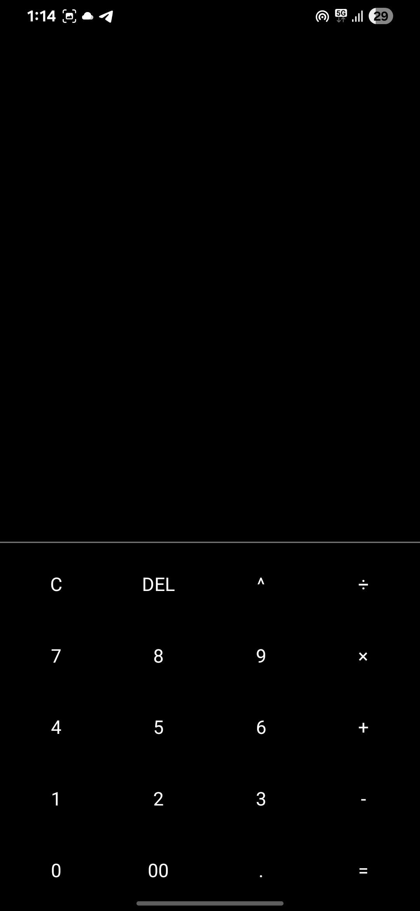
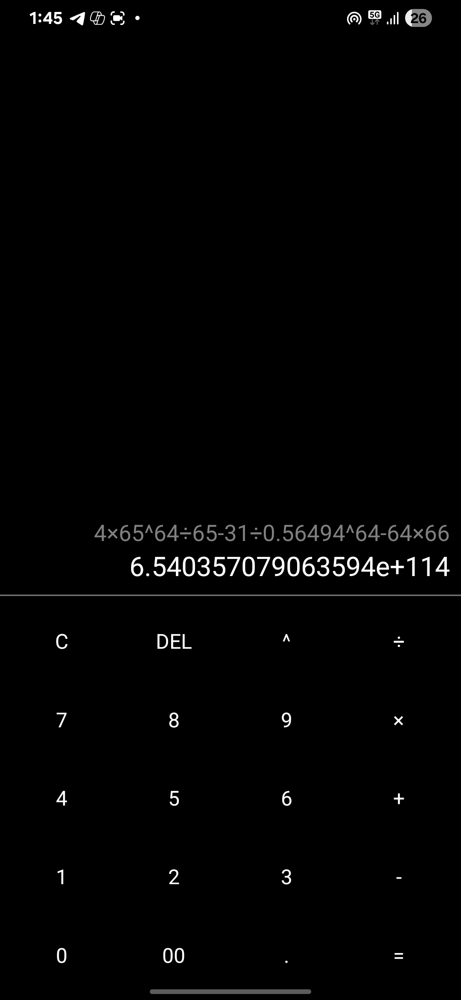
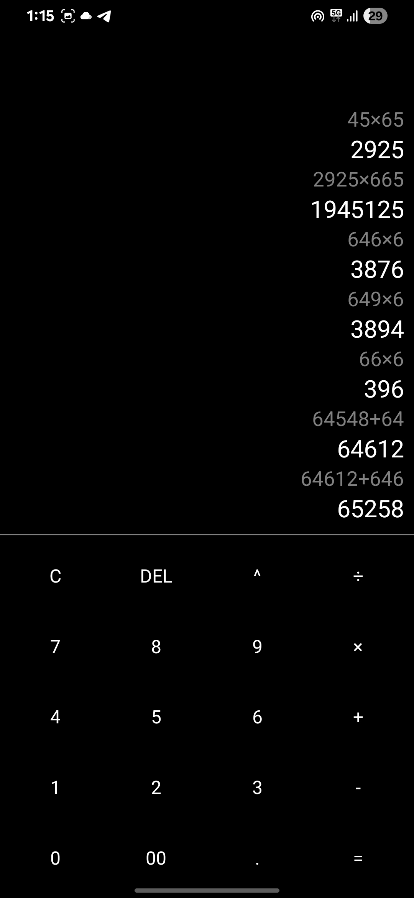
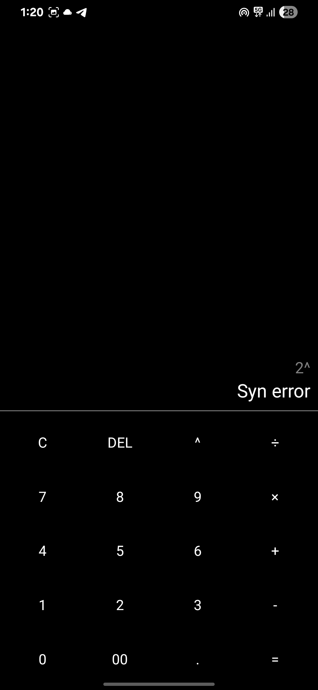

# 🧮 Calculator App

A cross-platform mobile calculator built using React Native, JavaScript, and Expo, designed for real-time expression evaluation with a smooth and interactive user experience.

---

## 🚀 Features

- 🔢 Real-time math expression evaluation with correct operator precedence
- 🧠 Intelligent input parsing for complex calculations
- 📜 Result history displayed with FlatList for quick access to previous results
- 💥 Haptic/vibration feedback on keypresses for better interaction
- 🧼 Clean and responsive UI that adjusts dynamically based on user input
- 📱 Optimized for both Android and iOS devices using Expo framework

---

## 📸 Screenshots

| Home Screen | Complex Expression | Result History | Syntax Error |
|------------|-------------|----------------|----------------|
|  |  |  |  |

---

## 🎥 Demo Video

<a href="https://www.instagram.com/reel/DM_EBd7B4bb">
  
</a>

---

## 🔧 Get started

1. Install dependencies 

   ```bash
   npm install
   ```

2. Start the app

   ```bash
   npx expo start
   ```

In the output, you'll find options to open the app in a

- [development build](https://docs.expo.dev/develop/development-builds/introduction/)
- [Android emulator](https://docs.expo.dev/workflow/android-studio-emulator/)
- [iOS simulator](https://docs.expo.dev/workflow/ios-simulator/)
- [Expo Go](https://expo.dev/go), a limited sandbox for trying out app development with Expo

You can start developing by editing the files inside the **app** directory. This project uses [file-based routing](https://docs.expo.dev/router/introduction).

## Get a fresh project

When you're ready, run:

```bash
npm run reset-project
```

This command will move the starter code to the **app-example** directory and create a blank **app** directory where you can start developing.

## Learn more

To learn more about developing your project with Expo, look at the following resources:

- [Expo documentation](https://docs.expo.dev/): Learn fundamentals, or go into advanced topics with our [guides](https://docs.expo.dev/guides).
- [Learn Expo tutorial](https://docs.expo.dev/tutorial/introduction/): Follow a step-by-step tutorial where you'll create a project that runs on Android, iOS, and the web.

## Join the community

Join our community of developers creating universal apps.

- [Expo on GitHub](https://github.com/expo/expo): View our open source platform and contribute.
- [Discord community](https://chat.expo.dev): Chat with Expo users and ask questions.
